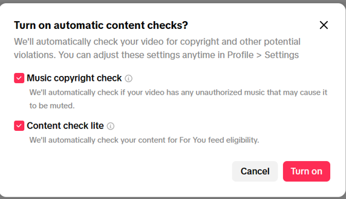
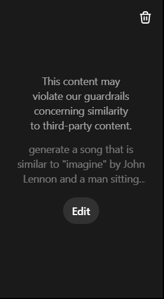

**Name: Kossay Srayaldin**
**CNET_ID: ksrayaldin**

**Copyright and Content Platforms**

**Tasks**

**1. Platform Copyright Policy Analysis:** 

Choose ONE platform to focus on for this assignment:

For this assignment, I am choosing **TikTok** since this platform allows me to upload videos quickly and without too much hassle. I was using a throwaway account I made on the spot for this assignment, and TikTok allowed me to create an account without too much verification, whereas instagram (originally, my first choice) was making me add my phone number to verify I am a real person. The same story goes for Youtube. 

Here are some facts about its Copyright policies:

**How does the platform detect copyrighted content? (automated systems like Content ID, manual reporting, etc.)**

The main enforcement policy TikTok follows is notice-and-takedown style. Copyright owners can send TikTok takedown requests if they notice a piece of content infringes their copyright. TikTok says that these reports are reviewed by a team of IP specialists to verify the accuracy of reports. 

Similarly, TikTok has platform-wide detection, especially audio. For example, TikTok wants its users to use its Commercial Music Library to make videos. If you use audio outside of the library, it requres a "Music usage confirmation". This is part of how TikTok prevents unlicensed music use. TikTok also warns that certain monetized content can trigger automatic muting (where TikTok just mutes copyrighted audio), which is done through an automated audio identification system. 

**What happens when content is flagged as potentially infringing?**

When Tiktok determines there has been a violation of its Intellectual Property Policy after a report is reviewed, TikTok states it will remove the content and notify both the reporter and the person who published the video of the action they took. 

Also, if an account receives three Copyright notices, Tiktok closes the account permanently for violation of its Terms of Service. Each warning TikTok issues expires in 90 days. Thus, this sort of permanent ban happens to accounts that receive three complaints, each for a different video, within 90 days. 

**What is the appeals or counter-notification process** 

When a piece of content is flagged or remove , Tiktok allows creators to appeal via the app by sending info and supporting evidence showing the creator has the right to post content flagged for removal. Also, TikTok allows its creators to issue counter-notification notices to copyright owners. These notices allow creators to respond to DMCA-style notices if they believe the content falls under fair use.

**How does the platform handle monetization of content containing copyrighted material?**

For content with commercial and/or promotional purposes, TikTok gives guidance to creators on how to avoid being flagged for copyright. For instance, TikTok highly incentivizes users to use its Commercial Music Library for audio because it is "pre-cleared" of any copyright complaints. Otherwise, if you use audio not in the library, then you must confirm you have the necessary rights/licenses. Because of its account removal/suspension policies, TikTok forces creators to comply with the law and only use content they are allowed to have so that they can have uninterrupted monetization. 

**Are there any special programs (e.g., YouTube's Content ID licensing agreements)?**

Tiktok does not have "Content ID"-style licensing systems the way Youtube does. The Commercial Music Library is probably the most important tool related to copyright which TikTok has. Also, TikTok maintains an Intellectual Property Protection Center (IPPC) which allows right owners to register their intellectual property, search, and submit their complaints through the TikTok app. 

**2. Fair Use Experiments**
In this case, I am uploading two different pieces of content testing the limits of fair use policies on Tiktok. Based on the instructions, I am going to be using two suggested methods: **Raw Copyrighted Clip** and **Commentary or criticism**.

**Raw Copyrighted Clip**: 

To test TikTok's ability to detect copyrighted content, I uploaded two different segments of a Copyrighted movie: **Django: Unchained** directed by Quentin Tarantino. I chose this movie not only because it was copyrighted, but because it contains coarse language and explores controversial topics through a display of power, cruelty, and struggle. It is indeed a difficult movie to watch for certain audiences as it depicts the mistreatment and disregard for Black people during 19th Century America. I am assuming that if this movie does not trigger Copyright flags in TikTok, it will trigger some sort of "inappropriate content" warning that could cause it to be taken down. In any case, I find that this experiment becomes even more interesting when applying it to pieces of film which are inadequate to some people. 

First, I uploaded a 3-minute clip with the title "Django Unchained: Mr.Candy Brings his guests home". The video is a clip from the movie for the minutes 1:27:01 to 1:30:12. It contains the footage of when Mr.Schultz (Christopher Waltz), Django (Jamie Foxx), and Calvin Candie / Mr.Candy (Leonardo DiCaprio) arrive to Candyland or simply Calvin's estate. When I uploaded the video to the platform, it gave me a pop-up message saying that TikTok will run their automatic copyright checks consisting of "Music Copyright" and "Content Check Lite". The first part checks the audio of the uploaded video to determine if it needs to be muted due to copyright infringement. The second part checks the type of content in order to classify it and distribute it to users' feeds. If the type of content is copyrighted or infringes TikTok's terms of service, the video does not get published. For better clarification, I searched TikTok's policy on content check lite in their terms of service. They state, "We'll do a quick check of your video against our Community Guidelines to ensure it's eligible for recommendation on the For You feed. You'll have a chance to fix any issues before posting. However, the check is preliminary and doesn't guarantee full compliance with our terms and guidelines". Here is an image of how that looks like:

After uploading the video, the checks began running in the background. The music check was prompt and the clip I uploaded passed it. I did not press upload until the second check was done. Here is an image depicting the first check:

.png>)

The second check took about five minutes to complete. When it was done, the video was uploaded automatically. But, there was a flag next to the title noting "Content Under Review" with a warning sign. This indicates that the "Content Check Lite" model is not enough to determine if a piece of content is completely free of copyright infringement. This suggests that there is a longer process that Tiktok runs in the background after a video gets uploaded which checks for copyright infringement. Here is how that looks like:

.png>)

Now, after an hour or so, the content under review flag went away and the video is still up as of today 12/16/2025, 24 hours after publishing it. Here is a link of the tiktok:

https://www.tiktok.com/@emmagreen544/video/7584256473182637342

I will include below a screenshot of the current state of things from the creator's perspective on TikTok. But, let me proceed to the next experiment.

Since the 3-minute clip of Django: Unchained did not get flagged as a copyright violation by TikTok, I decided to publish a longer unmodified clip of the same copyrighted movie.

Starting from the place the previous clipped stopped 1:30:12, I clipped a 15 minute and 23 second long excerpt from 1:30:12 to 1:45:35 in the movie. I published it with the same tiktok account titled: "Django Unchained: Mr.Schultz and Django arrive to Candyland". It went through the same preliminary check process as shown here:

.png>)

Again, the software approved the audio used in the video, but the content check took longer as expected. Surprisingly though, the content check failed the first time I ran it, as shown here:

.png>)

I retried the verification one more time, and it passed. However, the longer video had the flag "Content Under Review" when I published it. Here is a screenshot showing both videos published. Notice that the shorter video does not have the flag anymore, as I pointed before:

.png>)

A day after publishing, the 15-minute video apparently passed Tiktok's Content Review, and it does not have the "Content Under Review" flag. Here is a screenshot of that:

.png>)

Here is the link of the 15-minute excerpt of the movie:

https://www.tiktok.com/@emmagreen544/video/7584294135213952287

As of now, 12/16/2025 almost 24 hours after publishing the 15-minute excerpt of Django Unchained, the link above is still functional and has not been taken down.

It is interesting to me that the coarse language and graphic images from this scene did not trigger any inappropriate content flags, as of now. I think that displaying the cruelty of slavery and the historical mistreatment of Black people has become uncensored by mainstream media. This is probably in hopes of revealing how cruel slavery was and why some people struggle today, 160 years after its eradication.

**Commentary or Criticism**

In this experiment, I will use a different movie: **DownFall** by Bernd Eichinger and Oliver Hirschbiegel. This movie also explores a controversial topic that is difficult to digest for many viewers: The end of World War II

I obtained a clip of the movie from 00:38:54 to 00:45:27 for a total running time of 6 minutes and 33 seconds. I modified it in the following way: I  first added subtitles from the German audio to English text. Next, I added the song "Imagine" by John Lennon as a second track that begins playing in the background right after Adolf Hitler receives notice from one of his commanders informing him that Steiner's attack did not take place. The whole song plays until Hitler realizes the war is lost. It stops playing when he breaks a tear. The movie is practically silent for a moment here. I did not want to break that harmony. However, as soon as Hitler gets up, the problem at stake becomes apparent once again to everyone: What happens now? Who takes the reins when Hitler leaves? How will Germany save itself? Everyone gets tense, once more. At this moment, "Imagine" begins playing again, reminding us that the solution for what is at stake is in the lyrics. 

The reason I chose to add this song in the background of a movie such as "Downfall" is to try to create a sort of oxymoron. While the generals discuss about war, Germany's destiny, and their plans, the song is preaching to leave these old ways behind and to open up a new future where peace and non-violence is the pillar of everything. 

Also, I wanted to test whether John Lennon's song "Imagine" would be detected by TikTok as Copyright infringement. In that case, TikTok will follow its practice of muting videos that have copyrighted audio. But, in this case, I am using John Lennon's "Imagine" to add commentary and to give a different point of view to the movie. I am trying to add an artistic spin to the movie. However, I expect Tiktok to censor my content and, thus, my message.

Unsurprisingly, a few moments after upload, TikTok detected I was using "Imagine (Remastered 2010)" by John Lennon, and they indicated the following under Music Copyright check: "Copyright issues found. You can still post this video, but your video will be muted". Similarly, the Content Check lite process failed after running for 10 minutes, which might indicate that TikTok detected I was using a Copyrighted movie as well!

Here is the screenshot of the failed checks:

.png>)

Here is a screenshot with more details about the failed Music Copyright Check:

.png>)

After a second try, the "Content check lite" test was passed, and I published the video to TikTok. Yet, it was muted as expected. Here is a link to the published TikTok:

https://www.tiktok.com/@emmagreen544/video/7584577007036419358

In case these videos get taken down later on, I uploaded their mp4 files under the folder "Fair use experiments" in this repository. 

**3. AI-generated Content Investigation**

**Direct Reference**

For the first experiment, I tried to recreate the 3-minute clip from Django: Unchained that I first tested above. I looked up the dialogue for the scene, and I attempted to describe the scene as clearly as I could. I spent a significant amount of time building this prompt. I then obtained access to Sora, OpenAI's state of the art video-generation model. Yet, no matter how much I tweaked the prompt, Sora did not accept my request. It was not able to produce a video with the characteristics I described due to copyright concerns.

Nano Banana Pro was not able to produce the results I asked and other video generation tools were not available to me. 

I decided to reproduce the song "Imagine" by John Lennon using Sora, but I was also unsuccessful in reproducing it. Here is the message I obtained to the prompt: "Generate a song that is similar to 'imagine' by John Lennon and a man sitting on his piano singing it":

I also tested Sora with the following prompts and I had no luck generating anything like the song "Imagine":

"Create a song with the following lyrics:
Imagine there's no heaven
It's easy if you try
No hell below us
Above us, only sky
Nothing to kill or die for
And no religion, too
Imagine all the people
Livin' life in peace
You may say I'm a dreamer
But I'm not the only one
I hope someday you'll join us
And the world will be as one
Make it use John Lennon's voice and add piano to the background."

(I tried using the full lyrics but Sora complained that the input was very long)

"Create a song in the style of John Lennon that mimics the same theme as 'Imagine'"

"Create a song using John Lennon's voice that talks about world peace"

"Create a song about world peace. If you can, use John Lennon's voice"

When I used the prompt:

"Create a song about world peace"

Sora finally responded. 

The song was a generic video of a woman singing about world peace while playing a guitar. There are kids holding a globe and people making a circle. The video was very far from being anything close to "Imagine" by John Lennon.  

I did not want to give up, yet. I tried the same prompts in Suno and Beatoven. These are two AI companies that claim to produce high-quality AI music. Due to paywalls, I was not able to use their best models. However, even after asking for a song using the lyrics above, I obtained songs which are completely different. Suno produced generic lyrics which did discuss world a peace, a little. However, the music style was modern and auto-tuned and did not resemble "Imagine" at all. Even after I inputted the song as reference material in the prompt section. Beatoven produced a melody with no lyrics with little resemblance to the melody of the original. 

I uploaded all three files to Tiktok and they all passed successfully as shown here:

.png>)

.png>)

.png>)

Here are the links to all these Tiktoks, in the order presented above:

https://www.tiktok.com/@emmagreen544/video/7584621892628253983

https://www.tiktok.com/@emmagreen544/video/7584625908997213470

https://www.tiktok.com/@emmagreen544/video/7584629694369221918

**Style Mimicry**

Since replicating videos and songs which are remotely similar to highly copyrighted content seems too difficult to do, I used Nano Banana Pro from Gemini to create a new Album Cover to "Imagine" by John Lennon which includes the message: "What are you fighting for? How many cannons must a man shoot before he realizes he shot too many?" This quote is inspired by Bob Dylan. I added in the description of the TikTok that this video is meant to promote peace: "Spreading peace through the work of John Lennon with a key message in his famous album cover". I used the original unmodified song "Imagine" in the background and, as I expected, TikTok indicates that the song will be muted in the video. Here is a screenshot of that:

.png>)

This is how all my uploads look like:

.png>)

**4. Legal Analysis**

**Fair use Four Factors**:

**1. Raw Copyrighted Clip**:

In this case, I published a 3-minute and a 15-minute clip of a well-known copyrighted movie: Django Unchained. Here are some facts about fair use in regards to these clips:

(i) Purpose and character:

Both the 3-minute clip and the 15-minute clip display footage pulled directly from the movie. They are published on Tiktok for mostly entertainment. Even though the movie explores the historical topic of slavery and the South, the movie is mostly an entertaining stunt that is inspired on these times to make a new fictitious work of art. The two clips are not published out of necessity, such as to teach people about slavery. There are many other free and open-source resources which give a realistic picture of 19th Century America without the need to publish content that directors and investors spent so much on. 

(ii) Nature of the copyrighted work:

Django Unchained aims to give a realistic view of 19th Century America as well as slaver-slave dynamics. But, we should remind ourselves that this work is pure fiction and it was possibly thanks to the brilliance of Quentin Tarantino and his cast. This work is creative and original. 

(iii) Amount and substantiality used:

The 3-minute clip used a part of the movie which is considered comical to some and difficult to watch for others. I gave an outlook of power dynamics in the South without necessarily revealing too much about the movie. Interested viewers would be inclined to watch it after this short clip. The longer 15-minute clip reveals an extended excerpt of the movie and ends up giving a spoiler of an important part. This would probably make viewers disinterested in seeing the rest of the clip. 

(iv) Effect on the market for the original:

I consider the 3-minute clip to be good publicity for Django Unchained as it reveals the quirkiness and originality of the movie without giving spoilers which could ruin the viewers' experience. The 15-minute clip, on the other hand, gives away too much about the movie, which might make many viewers not bother to watch the rest. I consider the 3-minute clip to have a neutral to positive market value for the original, whereas the 15-minute clip has a clear negative effect on the market value of the original.

**2.Commentary or Criticism**

(i) Purpose and character:

The 6-minute clip from Downfall with "Imagine" playing in the background serves as a way to promote a positive message to a hard-to-watch movie clip. The characters discuss matters of war and hate, whereas the music in the background discuss matters of peace and love. I tried to add this layer of commentary to the clip because I thought it would create an oxymoron, which appears interesting to me. 

(ii) Nature of the copyrighted work:

In this case, both the movie clip and the background music are copyrighted. Putting them both together produces a new artistic expression that turns around the message of the movie into its opposite. This type of work is not found in Tiktok, and I thought it would be interesting to upload it. 

(iii) Amount and substantiality used:

I used about 6 minutes from the movie and around 3 minutes of "Imagine" (the entire song), repeated twice over the movie clip. I used this combination to transmit a new message that the clip by itself did not transmit, as well as to transmit a message that the song by itself did not produce. 

(iv) Effect on the market for the original:

Using such a tense and important part of the movie reveals the climax of "downfall" and spoils an important part of it, which I believe produces a negative effect on its market. Viewers would be led away from watching the movie after they watch the spoiler. As for the song, "Imagine", using it as background for the movie clip, also produces a negative effect on its market because people get inspired by its message without offering direct benefit to the people who created it. 